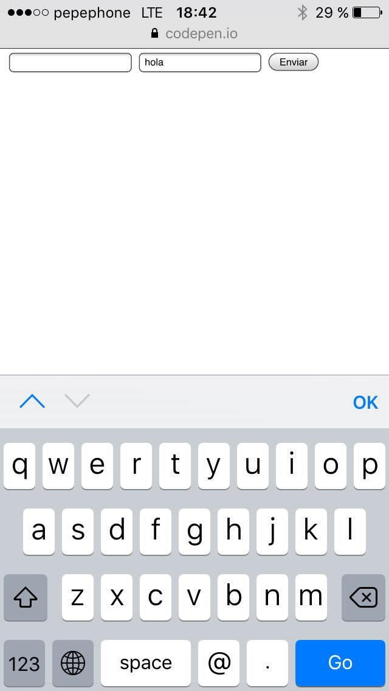
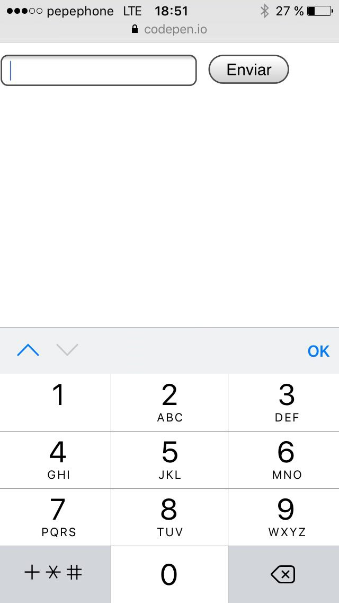
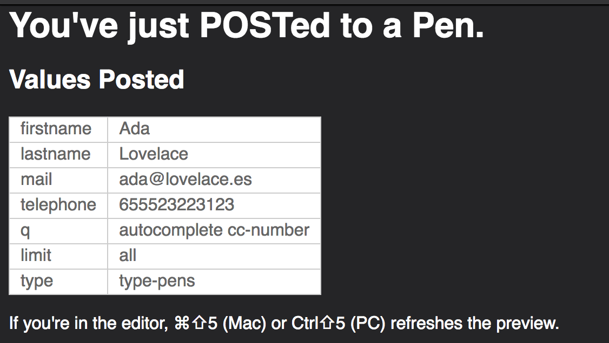
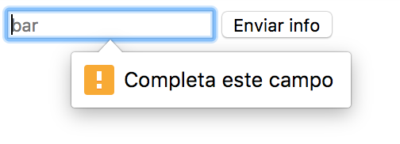
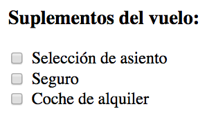
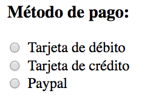
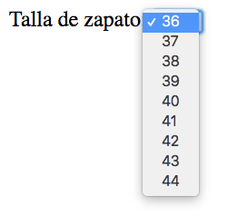
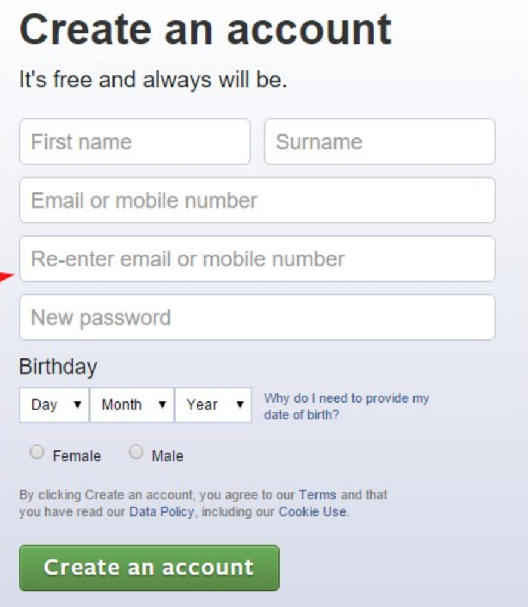

# Formularios

## Contenidos

<!-- TOC depthFrom:4 depthTo:4 updateOnSave:true -->

- [EJERCICIO 1](#ejercicio-1)
- [EJERCICIO 2](#ejercicio-2)
- [EJERCICIO 3](#ejercicio-3)
- [EJERCICIO 4](#ejercicio-4)
- [EJERCICIO 5](#ejercicio-5)

<!-- /TOC -->

## Introducción

Durante esta sesión vamos a ver cómo trabajar con formularios en HTML para poder enviar información a través de una página web. Nadie se mete a programador web porque su sueño sea hacer formularios, pero son una parte fundamental de la web y al final es la forma en la que enviamos información; sin ellos no podríamos ser capaces de enviar información por Internet más que navegar entre páginas.

Los primeros años de la web, estos formularios sólo permitían introducir algunos campos de texto y poco más, todo ello de forma trivial.

Hoy en día podemos enviar archivos como datos de un formulario, seleccionar colores o, incluso, validar los formularios antes de enviarlos.

## ¿Para qué sirven?

Como hemos comentado los formularios sirven para enviar información al servidor, ya sea para actualizar datos de alguna cuenta, realizar una búsqueda en algún sitio web, cambiar los datos de nuestro perfil...Cualquier gestión de este tipo se hace a través de formularios y prácticamente cualquier web que no sea de consulta de información contiene uno como mínimo.

## ¿Cómo funcionan?

Los formularios funcionan de la siguiente manera:

1. El usuario rellena la información y pulsa el botón enviar para enviar esa información al servidor que será el que se encargue de procesarla. La envía de la misma manera que enviamos una petición para ver una página, pero en este caso junto con la petición envía todos los datos que el usuario ha introducido.
2. El servidor procesa la información recibida usando el código encargado de procesarlo (este código ha sido programado por un programador back-end). Lo normal es que en ese código se validen que los campos son correctos y se procesen los datos (se guarde información de un usuario en la base de datos, se compruebe si los datos de acceso de un usuario son correctos, se guarde una imagen en el servidor, etc.)
3. El servidor devuelve una respuesta al usuario, esta respuesta suele ser una página web nueva, es decir, devuelve una nueva página y el usuario es redirigido a esa página en la que es normal poner un mensaje del estilo "tu información se ha guardado correctamente" o "ha habido un error".

Hoy en día todo este proceso de comunicarse con el servidor y enviar la información de un formulario se puede hacer usando JavaScript. Más adelante veremos cómo hacerlo y cómo utilizar este lenguaje para validar que la información es correcta y mandar información al servidor sin tener que recargar o cambiar la página y de manera casi instantánea.

## ¿En qué casos se utilizan?

Como hemos comentado, cualquier página que no sirva simplemente para mostrar información es muy probable que tenga como mínimo un formulario. Los ejemplos más típicos de usos de formularios son:

- Como campo de búsqueda. La barra de búsqueda que hay en la página de Google, por ejemplo.
- Para iniciar sesión o registrarse en una web. Los formularios de inicio de sesión de Facebook o Twitter.
- Para chats. Como el campo de enviar mensaje de la versión de WhatsApp para web
- Los procesos de compra. Todos los formularios para introducir tu dirección, el número de tarjeta, etc...

Esos son unos pocos ejemplos, pero hay miles y probablemente a ti te haya venido a la cabeza más de uno antes de leer esta sección.

## Nuestro primer formulario en HTML

Ahora que ya sabemos un poco qué es y para qué sirven los formularios vamos a ver cómo escribir el HTML necesario para generarlos.

En HTML antes de escribir un campo de formulario, por norma general (aunque no es estrictamente necesario), se escribe previamente la etiqueta `<form>` que será la que utilicemos para envolver los campos. Esta etiqueta suele ir siempre acompañada de dos atributos `method` y `action` y es invisible, no muestra nada en la pantalla. Se escribe de la siguiente forma:

```html
<form action="/signup" method="post">
  <!-- Aquí iría el contenido del formulario -->
</form>
```

El atributo `method` sirve para especificar el método que utilizaremos para enviar nuestra información. No vamos a profundizar mucho en este tema pero es importante que sepamos que hay dos métodos distintos para enviar información a través de un formulario y esos métodos son POST y GET.

Como norma general utilizaremos el valor `post` para enviar datos sensibles (contraseñas, dni, cuentas bancarias, número de tarjeta, etc) y `get` para el resto de casos.

El atributo `action` se usa para indicar la dirección del servidor donde se envían los datos del formulario. Es, por tanto, el puente de comunicación de nuestro front-end con el back-end donde se reciben y manipulan los datos del usuario.

Bien, ya tenemos el envoltorio para nuestro formulario. Ahora es el momento de introducir los campos que queremos que rellene la persona que va a visitar nuestra página web. Para ello, tenemos distintos tipos de campos pero el más común suele ser el de texto, así que empezaremos con ese.

Para crear un campo de texto, utilizaremos la etiqueta `<input>` de HTML. Esta etiqueta tiene un atributo especial llamado `type` con el cual definiremos qué tipo de campo será (texto, mail, contraseña, etc.). Para este caso usaremos `type="text"` para que cree un campo de texto donde podamos introducir texto normal, como nuestro nombre, apellidos, etc.

Junto con el atributo `type`, tenemos otro atributo especial llamado `name` que se utiliza en los formularios para definir cuál será el nombre del campo. De esta forma cuando el usuario pulse el botón de enviar del formulario, llegará la información que ha introducido en este campo asociado al nombre que hayamos establecido. Por ejemplo, si tenemos un input con el atributo `name="lastName"`. Al servidor le llegará un dato llamado _lastName_ que contendrá la información que el usuario haya introducido en ese campo. Podemos usar cualquier valor para `name` pero debemos coordinarnos con la gente de back-end ya que debemos usar el mismo nombre para que luego no haya problemas. Por ejemplo, si usamos un nombre distinto en back-end y front-end fácilmente podemos hacer que el formulario deje de funcionar porque creemos que un campo no se ha enviado y es que en realidad hemos usado otro nombre.

```html
<form action="/signup" method="post">
  <input type="text" name="firstName" />
  <input type="text" name="lastName" />
</form>
```

> **Nota:**
> La etiqueta input es una etiqueta sin contenido, por lo que no es necesario escribir la etiqueta de cierre. Otro detalle que podemos apreciar es que los campos se muestran en línea ya que por defecto los navegadores lo muestran con `display: inline-block;`. Podemos asignarles `display: block` para hacer que se apilen en vertical, uno debajo de otro.

Ya tenemos nuestro formulario con los dos campos necesarios para que funcione, pero nos falta lo más importante, poder enviar el formulario. Para esto vamos a usar también una etiqueta input pero en este caso va a ser del tipo `submit` (`type="submit"`). Si introducimos esta etiqueta en nuestro formulario se mostrará un botón que, al ser pulsado, enviará el formulario. Para establecer qué texto queremos que vaya dentro del botón, usaremos el atributo `value`. Otra cosa a destacar es que el botón tiene una serie de estilos CSS aplicados por defecto pero que podemos modificar añadiéndole unos nuevos que sobrescriban a los anteriores.

```html
<form action="/signup" method="post">
  <input type="text" name="firstName" />
  <input type="text" name="lastName" />
  <input type="submit" value="Enviar info" />
</form>
```


Hay dos cosas que son recomendables y nos faltan aquí, y son bastante importantes de cara a la experiencia del usuario. Como se puede ver, no sabemos qué debemos meter en cada campo y no tenemos un ejemplo del texto que podemos introducir, lo que hace muy difícil saber que se nos está pidiendo. Para solucionar este problema tenemos el atributo `placeholder` y la etiqueta `<label>`.

La etiqueta label se utiliza para mostrar el título del campo, describe qué información debemos introducir en él. La manera más indicada de utilizar una etiqueta `<label>` es incluirla justo antes del `<input>` al que acompaña. Una de las cualidades de esta etiqueta es que si pulsas sobre ella nos colocamos en el campo al que acompaña.

Para decirle al navegador que nuestra etiqueta `<label>` está relacionada con un determinado `<input>` debemos hacer dos cosas, asignar un id al input para identificarla de manera unívoca y añadir el atributo `for` a `<label>` con el id que hemos puesto al input, quedando como resultado el código que mostramos a continuación:

```html
<form action="/signup" method="post">
  <label for="firstName">Nombre</label>
  <input id="firstName" type="text" name="firstName" />
  <label for="lastName">Apellido</label>
  <input id="lastName" type="text" name="lastName" />
  <input type="submit" value="Enviar info" />
</form>
```


> **Nota:**
> Es importante apreciar que dentro del input el atributo `name` y el `id` pueden ser distintos, pero el `for` del label siempre debe coincidir con el `id` del input.

El atributo `placeholder` se puede asignar a un input y sirve para establecer el texto que se mostrará en el campo cuando este esté vacío. Es una buena práctica usarlo como pista para que la persona que está rellenando el formulario sepa qué información debe introducir. Por ejemplo, podemos darle pistas sobre cómo debe escribir los datos para que no pase un error típico que escribir el nombre y el apellido en el mismo campo (poner Jon Nieve puede ser una opción).

```html
<form action="/signup" method="post">
  <label for="firstName">Nombre</label>
  <input placeholder="Jon" id="firstName" type="text" name="firstName" />
  <label for="lastName">Apellido</label>
  <input placeholder="Nieve" id="lastName" type="text" name="lastName" />
  <input type="submit" value="Enviar info" />
</form>
```


Bien, continuemos introduciendo campos. Este ejemplo se empieza a parecer a un formulario de registro, así que vamos a continuar como si se tratase de uno. En un formulario de este tipo, lo normal después del nombre es escribir el mail, para esto utilizaremos también la etiqueta `<input>` pero esta vez utilizaremos `type="email"` para definir el campo como una dirección de correo.

```html
<form action="/signup" method="post">
  <label for="fullName">Nombre completo</label>
  <input type="text" id="fullName" name="fullName" />
  <label for="emailAddress">Correo electrónico</label>
  <input type="email" id="emailAddress" name="emailAddress" />
  <input type="submit" value="Enviar" />
</form>
```

A simple vista, parece que no hay diferencia entre los tipos `email` y `text` pero sí que la hay, lo que pasa es que es difícilmente perceptible. La diferencia entre ambos es que cuando usamos el tipo `email`, al pulsar el botón de enviar en el formulario, se comprobará primero que el mail introducido es una dirección de correo válida y si es así se enviará y si no es correcta se mostrará un mensaje como el que aparece en la imagen que se muestra a continuación.


Otra diferencia entre el tipo `email` y el tipo `text` es que si abrimos la página web del formulario desde un móvil, al pulsar sobre el campo del tipo `email` se abrirá un teclado diferente al que se muestra cuando pulsamos en el campo del tipo `text`. Este teclado es especial para escribir direcciones de correo electrónico y, por ejemplo, facilita escribir el símbolo `@`.



Bien, tenemos el nombre y el email, vamos con el siguiente, el teléfono. Para el campo teléfono sucede lo mismo que para el del email. En vez de usar `type="text"` utilizaremos `type="tel"`. En este caso no nos validará el teléfono antes de enviarlo porque hay teléfonos muy raros y en muchos casos también van acompañados de guiones o puntos y es complejo de gestionar. Aún así si utilizamos `type="tel"` si que nos mostrará un teclado numérico en el teléfono para facilitarnos el trabajo a la hora de escribir la información como se puede ver en la captura de pantalla.

```html
<form action="/signup" method="post">
  <label for="telephone">Teléfono</label>
  <input type="tel" id="telephone" name="telephone" />
  <input type="submit" value="Enviar" />
</form>
```



Tenemos prácticamente todo pero nos quedaría algo bastante importante, la contraseña. Para crear un campo para nuestra contraseña continuamos con el mismo procedimiento que en los anteriores campos, esta vez usando `type="password"` como atributo para definir el tipo de campo. Los campos tipo password tienen una diferencia frente al resto y es que sustituyen el texto que contienen por puntos negros (●) para aumentar la seguridad y que la contraseña no sea visible.

Otra peculiaridad de los campos del tipo `password` es que su contenido se borra si se recarga la página, mientras que en un campo de texto normal el contenido se mantiene tras la recarga.

```html
<form action="/signup" method="post">
  <label for="password">Contraseña</label>
  <input type="password" id="password" name="password" />
  <input type="submit" value="Enviar" />
</form>
```


#### EJERCICIO 1

Sin que sirva de precedente, vamos a realizar este ejercicio directamente en Codepen. Esto nos permitirá comprobar cuales son los datos que se envían en el formulario ya que cuando creamos un formulario en Codepen, al enviarlo, nos muestra una ventana con la información que le llegaría al servidor. Esto nos permite comprobar que funciona correctamente y ver qué es lo que llegaría en cada caso. Es importante que dejemos el atributo `action` de la etiqueta `<form>` vacío y que el método sea del tipo `post`.



Vamos a crear un formulario de envío con los siguientes campos:

- Nombre
- Apellido
- Email
- Calle
- Ciudad
- Provincia
- País
- DNI
- Teléfono
- Contraseña
- Confirmar contraseña
- Botón de enviar

Todos los elementos deberán de tener un atributo `placeholder` e ir acompañados de un `label` para definir qué se debe introducir en cada uno de ellos

> **Nota:** en los ejercicios largos como este, recordad cambiar quién está a los mandos en el pair programming a mitad del ejercicio.

\_\_\_\_\_\_\_\_\_\_

## Atributos básicos

Además de los atributos que hemos visto hasta ahora, existen otra serie de atributos comunes a todos los campos de un formulario que permiten cambiar su comportamiento o añadirles información.

### Required

El atributo `required` sirve para establecer que un campo es obligatorio y debe ser rellenado antes de enviarse el formulario. Por defecto muchos navegadores antes de enviar un formulario comprueban que los campos con el atributo `required` están asignados antes de enviarlos y, en caso de no estarlo, muestran un mensaje de error informando al usuario de que estos campos son obligatorios. Para establecer un campo como obligatorio sólo debemos de añadirle el atributo `required`.



> **Nota:**
> El atributo required solo puede ser verdadero o falso, por lo tanto no tendrá un valor asignado. Simplemente si una etiqueta tiene el atributo `required` (sin más) indicará que este elemento es obligatorio y si no lo tiene indicará que no lo es.

```html
<!-- Campo obligatorio -->
<input type="text" id="firstName" name="firstName" required />

<!-- Campo no obligatorio -->
<input type="text" id="firstName" name="firstName" />
```

### Value

El atributo _value_ sirve para definir el valor inicial de un campo, su contenido. De esta forma, si creamos un input de texto con un atributo `value="Calle Méndez Álvaro"`, por defecto dentro del campo se verá escrito _"Calle Méndez Álvaro"_.

Este valor es opcional excepto cuando el atributo `type` de la etiqueta es `radio` o `checkbox` (los veremos más adelante).

Ejemplo de uso:

```html
<label for="address">Dirección:</label>
<input type="text" id="address" name="address" value="Calle Méndez Álvaro" />
```

### Disabled

El atributo `disabled` sirve para desactivar un campo de un formulario.

> **Nota:**
> En el caso de disabled pasa como con el atributo `required`, con añadir el atributo sin ningún valor es suficiente para indicar que un elemento está desactivado.

```html
<input
  type="text"
  id="address"
  name="address"
  value="Calle Méndez Álvaro"
  disabled
/>
```

#### EJERCICIO 2

Vamos a añadir un atributo `required` a todos los campos del ejercicio anterior excepto al apellido.

Además añadiremos un valor por defecto a la ciudad y al país para poner Madrid y España.

Para comprobar que funciona correctamente intentaremos enviar el formulario sin rellenar ningún campo y ver si nos muestra el error.

\_\_\_\_\_\_\_\_\_\_

## Opciones: Checkbox, Radio y Select

En la actualidad, disponemos de múltiples formas de introducir información mediante opciones. A diferencia de los campos, las etiquetas de opciones nos permitirán elegir entre ninguna, una o más opciones y según el carácter de los datos que queremos obtener usaremos un tipo determinado u otro.

### Checkbox

Los checkbox nos permiten elegir entre una serie de opciones que no son mutuamente excluyentes, es decir, que podemos perfectamente seleccionar más de una.

```html
<h3>Suplementos del vuelo:</h3>
<div>
  <label for="flightoption1">
    <input
      id="flightoption1"
      type="checkbox"
      value="chooseseat"
      name="flightoptions"
    />
    Selección de asiento
  </label>
</div>
<div>
  <label for="flightoption2">
    <input
      id="flightoption2"
      type="checkbox"
      value="assurance"
      name="flightoptions"
    />
    Seguro
  </label>
</div>
<div>
  <label for="flightoption3">
    <input
      id="flightoption3"
      type="checkbox"
      value="rentcar"
      name="flightoptions"
    />
    Coche de alquiler
  </label>
</div>
```

> Todas tienen el mismo `name` y diferentes `id`.



### Radio

Los input del tipo `radio` nos permiten crear selecciones que se excluyan entre sí. Un ejemplo muy claro es cuando seleccionamos el tipo de pago, seleccionamos uno de una lista de posibles tipos de pagos y, como no tiene sentido, no nos dejará seleccionar más que uno.

```html
<h3>Método de pago:</h3>
<div>
  <label for="paymentmethod1">
    <input
      id="paymentmethod1"
      type="radio"
      value="debitcard"
      name="paymentmethods"
    />
    Tarjeta de débito
  </label>
</div>
<div>
  <label for="paymentmethod2">
    <input
      id="paymentmethod2"
      type="radio"
      value="creditcard"
      name="paymentmethods"
    />
    Tarjeta de crédito
  </label>
</div>
<div>
  <label for="paymentmethod3">
    <input
      id="paymentmethod3"
      type="radio"
      value="paypal"
      name="paymentmethods"
    />
    Paypal
  </label>
</div>
```

> Todas tienen el mismo `name` y diferentes `id`.



### Select

Las etiquetas `select` nos permiten crear selecciones que se excluyan entre sí y que permitan elegir entre un número de opciones considerable.

Un ejemplo muy claro es el caso de la selección de una talla para zapatos. En ese caso concreto podríamos utilizar también un `input` del tipo `radio`, el problema es que en el rango de tallas de zapatos puede haber perfectamente más de 10 tallas y mostrar 10 elementos del tipo radio ocuparía mucho espacio de la página. Debido a esto utilizaremos para ese tipo de casos el `select` ya que abre un desplegable y ocupa mucho menos espacio que el input `radio` aparte de que permite navegar mejor entre los valores porque, por ejemplo, puedes introducir un número y te lleva a la primera ocurrencia.

```html
<label for="size">Talla de zapato:</label>
<select id="size" name="size">
  <option value="36">36</option>
  <option value="37">37</option>
  <option value="38">38</option>
  <option value="39">39</option>
  <option value="40">40</option>
  <option value="41">41</option>
  <option value="42">42</option>
  <option value="43">43</option>
  <option value="44">44</option>
  <!-- ... continuación de la serie -->
</select>
```



## Otros campos

### Área de texto

Para crear un área de texto utilizaremos la etiqueta `textarea`. Esta etiqueta tiene dos atributos específicos:

- `rows`: Nos permitirá definir el número de filas (altura) que tendrá por defecto la etiqueta.
- `columns`: Nos permitirá definir el número de columnas (anchura) que tendrá por defecto la etiqueta.

Ejemplo de uso:

```html
<label for="comments">Comentarios:</label>
<textarea id="comments" name="comments" rows="8" cols="80"></textarea>
```


### Número

Para introducir un campo para un número, utilizaremos la etiqueta HTML de `input` con el atributo `type="number"`. Esta etiqueta sirve para campos en los que sólo queramos que se introduzcan números (códigos postales, cantidad de productos, números de domicilio, etc).
Algunos de los atributos que acepta:

- `min="0"` sirve para indicar el mínimo valor posible que podemos introducir en el campo.
- `max="10"` sirve para indicar el número máximo que podemos introducir en el campo.
- `step="2"` sirve para definir cómo será el incremento de los campos.

Ejemplo de uso:

```html
<label for="age">Edad:</label> <input type="number" id="age" name="age" />
```

### Campos ocultos

En determinados casos es necesario incluir en nuestro formulario un campo oculto para enviar información al servidor que en vez de escribir el usuario, rellenaremos usando JavaScript. Por ejemplo, algunos servicios de soporte de aplicaciones web recogen información de nuestro sistema operativo (Windows, Linux, Mac...), nuestro navegador (Firefox, Chrome, Safari...) y nuestro tipo de dispositivo (ordenador, móvil, tablet, etc) y lo envían mediante el uso de etiquetas ocultas en el formulario.

Por defecto las etiquetas ocultas se muestran con el atributo `display: none;` asignado y por tanto no son visibles por el usuario. Dada su función esto es totalmente lógico.

```html
<input type="hidden" id="productid" name="productid" value="xm234jq" />
```

#### EJERCICIO 3

En este ejercicio vamos a crear el formulario de Facebook. Para crearlo utilizaremos lo que hemos visto hasta ahora de formularios. El formulario en sí será el que se muestra en la imagen inferior. El objetivo es crear sólo el HTML pero si te atreves puedes probar también a realizar un CSS similar.



Además de lo que se ve, vamos a crear los siguientes campos:

- Un campo oculto que muestre el navegador que estamos usando (pondremos el valor directamente en el HTML usando el atributo `value`)
- Un campo numérico donde podamos introducir nuestra altura en centímetros y que tenga como máximo 250 cm y como mínimo 50cm y por defecto tenga un valor de 150 cm
- Un área de texto donde escribir un comentario para tu perfil
- Un tipo de campo que se pueda activar y desactivar y en el que el usuario indique que ha aceptado los términos y condiciones de Facebook

\_\_\_\_\_\_\_\_\_\_

## Agrupando partes del formulario por contexto

A veces los formularios poseen gran cantidad de campos a rellenar y es difícil seguir la pista de cuáles van a ser esos datos o dónde estará colocado cada uno. Cómo solución a este problema, HTML nos brinda las etiquetas `fieldset` y `legend` que nos permitirán agrupar elementos de un formulario tal y como deseemos.

### Fieldset

Utilizaremos esta etiqueta para crear secciones dentro de nuestro formulario.

```html
<fieldset>
  <label for="name">Nombre</label>
  <input type="text" id="name" name="name" />
  <label for="surnames">Apellidos</label>
  <input type="text" id="surnames" name="surnames" />
  <label for="phone">Teléfono</label>
  <input type="tel" id="phone" name="phone" />
  <label for="postalcode">Código postal</label>
  <input type="number" id="postalcode" name="postalcode" />
</fieldset>
```

### Legend

Esta etiqueta nos permite asignar el nombre de una sección de nuestro formulario creada con `fieldset`. Se colocará siempre dentro del `fieldset`para indicar el nombre o el tipo de contenido que se agrupa.

Como convención, la etiqueta `legend` se suele colocar la primera dentro del contenido del `fieldset`. Ésta, la coloquemos donde la coloquemos, siempre se mostrará en la parte superior izquierda del `fieldset` pisando el recuadro que dibuja este, pero siempre podemos modificar su posición utilizando CSS.

```html
<fieldset>
  <legend>Datos personales:</legend>

  <label for="name">Nombre</label>
  <input type="text" id="name" name="name" />
  <label for="surnames">Apellidos</label>
  <input type="text" id="surnames" name="surnames" />
  <label for="phone">Teléfono</label>
  <input type="tel" id="phone" name="phone" />
  <label for="postalcode">Código postal</label>
  <input type="number" id="postalcode" name="postalcode" />
</fieldset>
```

## Restaurar el formulario a los valores por defecto

Muchas veces habrás visto en algunos formularios que existe un botón que directamente restablece todos los campos a su valor por defecto, o dicho de otra forma, que borra la información que hemos introducido y la deja como estaba al cargar la página.

Para crear un botón en nuestro formulario que realice esta acción de establecer todos los campos a su valor por defecto utilizaremos un `<input>` del tipo reset:

```html
<input type="reset" value="Restaurar valores por defecto" />
```

Este botón siempre borrará toda la información de los campos que haya dentro de la etiqueta `<form>` que lo contenga.

#### EJERCICIO 4

En el formulario de facebook, añadir un botón para borrar la información.

\_\_\_\_\_\_\_\_\_\_

## Estilos CSS de un formulario

Los estilos de los formularios varían mucho entre navegadores porque todos aplican estilos por defecto. A algunos elementos de formularios no se les puede aplicar estilos, como a los `<option>`, es por eso que al final en muchas empresas los desarrolladores crean, utilizando otras etiquetas, sus propios campos _customizados_ para adaptar los estilos a sus necesidades. Nosotros vamos a ceñirnos a los estilos por defecto pero en el futuro veremos cómo crear usando HTML, CSS y JavaScript un componente de formulario customizado.

Una cosa que sí que debemos tener en cuenta es que en móvil por defecto se aplican una serie de estilos a nuestros botones e inputs que modifican bastante su apariencia aplicando bordes redondeados y un fondo con degradado. Esto es un problema que viene de los comienzos de la _era mobile_, cuando las webs no se adaptaban a dispositivos móviles y era difícil visualizarlas correctamente. En ese momento se decidió aplicar un estilo por defecto a los campos y botones para que fuesen más intuitivos. Hoy en día los desarrolladores tienen en cuenta esto y, más que ser útil, termina siendo molesto pero tiene solución. Para que estos estilos no se apliquen a nuestros campos lo que debemos hacer es añadirles el atributo `appearance: none;` de la siguiente forma:

```css
input {
  -webkit-appearance: none;
  -moz-appearance: none;
  appearance: none;
}
```

> **Nota:**
> El prefijo `-webkit-` y `-moz-` es específico para aplicar esto a los navegadores Safari y Chrome, y Mozilla Firefox respectivamente

## Expresiones regulares (aka regex) (aka regexp)

En la vida en general hay muchas cosas que cumplen patrones y en particular en programación queremos identificar o encontrar esos patrones. Hay millones de ejemplos de patrones que se pueden identificar con expresiones regulares:

* Email: `nombre` + `@` + `dominio` + `.` + `extensión de dominio`. Si un email no tiene alguno de estos campos en este orden, no es un email válido.
* Matrícula de los coches: `4 números` + `3 letras`.
* DNI: `de 1 a 7 números` + `1 letra`.
* CSS: `.` + `nombre de la clase` + `{` + `nombre de la propiedad` + `:` + `valor de la propiedad` + `;` + `}`. Para saber si nuestro código está bien escribo VSCode, el servidor, chrome... utilizan muchas regex.
* Colores RGB: `#` + `6 números o letras de la A a F`.
* La terminal: cuando escribimos `cp -r /carpetaA /carpetaB` la terminal sabe `-r` es una opción (y no una carpeta) porque tiene un guión delante.
* Idiomas: un programa puede deducir si un texto está en español si contiene letras como ñ, acentos... y no contiene otras letras como &#20320;.
* Nombres y apellidos: solo pueden tener letras, espacios y guiones.
* Precio de un producto: `número entero` + `,` + `número decimal` + `€`. Si tiene letras u otros símbolos no es un precio válido.

> Los inputs de HTML también pueden evaluar si el texto que la usuaria ha introducido cumple con un patrón o no.

> JavaScript tiene formas de evaluar diferentes textos con expresiones regulares y de esta forma saber si el texto cumple o no con el patrón de la expresión regular.

Las expresiones regulares tienen la siguiente pinta `^[0-9]{4}[a-zA-Z]{3}$`. Si evaluamos la matrícula _1234CDC_ con esta regex nos dirá que sí cumple el patrón. Vamos a analizar lo que espera la esta regex:

* ^: el acento circunflejo ^ indica el inicio de la regex.
* [0-9]: la regex espera caracteres del 0 al 9, es decir, números.
* {4}: la regex espera 4 caracteres de los anteriores, es decir, 4 números.
* [a-zA-Z]: a continuación de los 4 números, porque el orden es importante, la regex espera caracteres de la _a_ a la _z_ (en minúsuclas) y / o de la _A_ a la _Z_ en mayúsculas.
* {3}: cuántas letras de las anteriores espera, pues 3.
* $: aquí debe acabar la regex, es decir si hubiese más caracteres después de las 3 letras, entonces no sería una matrícula.

> A lo largo de vuestra vida como programadoras a veces odiaréis las regexp hasta que un día os solucionen de forma simple un problema complejo y entonces... **I ♥ RegExp**.

#### EJERCICIO 5

Crea un formulario similar al de la imagen, que es el de registro de Gmail.


Modifica el formulario anterior para que se hagan las siguientes validaciones:

- Todos los campos excepto sexo son obligatorios
- La dirección de correo actual debe ser una dirección de correo válida
- El teléfono debe ser un número de teléfono válido en España (**PISTA**: buscad cómo usar el atributo `pattern`)
- Día y año (de la fecha de nacimiento) deben ser numéricos

\_\_\_\_\_\_\_\_\_\_

## BONUS

### Más atributos y etiquetas

Existen muchos otros tipos distintos de etiquetas para formularios y atributos, pero en este caso solo hemos querido mostrar los principales ya que sino no daría tiempo a ver todos. Por ejemplo, podemos usar una [barra de progreso](https://developer.mozilla.org/en-US/docs/Web/HTML/Element/progress), [enlazar un fichero de nuestro ordenador](https://developer.mozilla.org/en-US/docs/Web/HTML/Element/input/file) o [recoger una fecha](https://developer.mozilla.org/en-US/docs/Web/HTML/Element/input/date). El resto tienen muchas cosas en común y pueden consultarse las guías de MDN.

- [Guía de formularios de MDN](https://developer.mozilla.org/es/docs/Learn/HTML/Forms)
- [Guía de formularios de MDN (inglés y más completa)](https://developer.mozilla.org/en-US/docs/Web/Guide/HTML/Forms)
